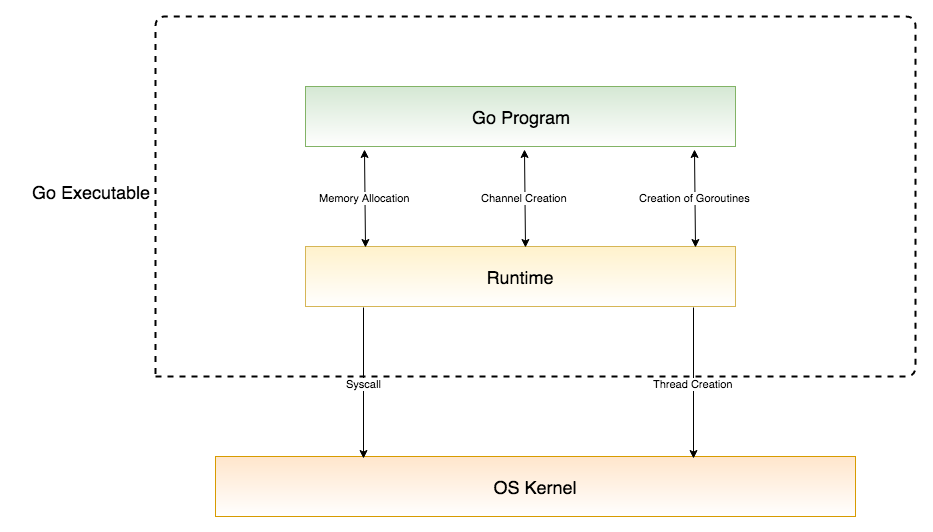
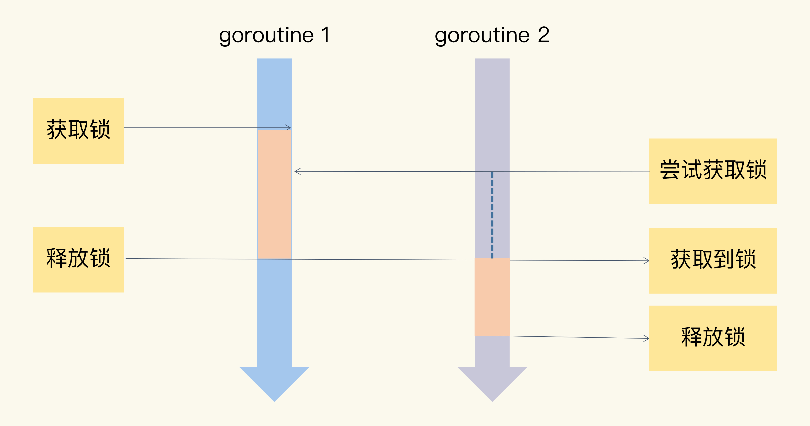
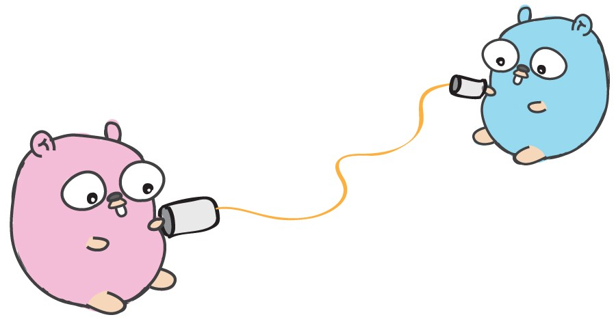
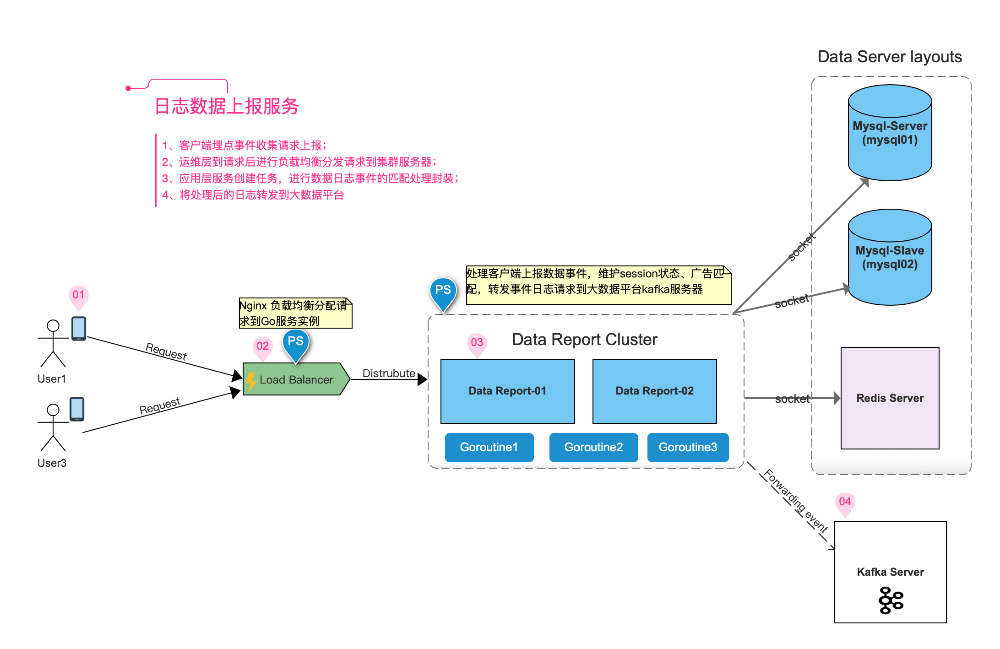

## 浅谈Go并发编程

### 一、为什么选择Go语言
1. 最求极致的简单
- 大道至简，小而蕴真(Less can be more)
- 简单易学
- C++ 11 84个关键字, PHP 65个关键字,  Java 52个关键字, Go只有区区25个关键字。 

2. 高效
- 天生支持并发
- 支持垃圾回收机制
- 支持指针访问内存

3. 生产力
- 简洁清晰的依赖管理
- 独特的接口类型设计
- 支持复合而支持继承的扩展方式

<br/>
后端IO性能对比参考
https://www.toptal.com/back-end/server-side-io-performance-node-php-java-go


###  二、并发编程

#### 1.  什么是并发

> Go语言的并发是属于Go的一大亮点，支持创建协程而非其它语言如Java的线程。

- <span style="color:#ff502c;font-size: .87em; padding: .065em. 4em">并发(concurrent)</span> 是指在同一个时间点上只能执行同一个任务，但是因为速度非常快，所以就像同时进行一样。


- <span style="color:#ff502c;font-size: .87em; padding: .065em. 4em">并行(Parallel)</span> 是指在一个时间点上同时处理多个任务。 并行它不一定快，需要电脑CPU多核支持，单核CPU是不支持并行的。因为并行运行时需要通信，通信也是有成本的且成本很高。

- <span style="color:#ff502c;font-size: .87em; padding: .065em. 4em">进程(Process)</span> 是指具有一定独立功能的程序关于某个数据集合上的一次运行活动,进程是系统进行资源分配和调度的一个独立单位。每个进程都有自己的独立内存空间，不同进程通过进程间通信来通信。

- <span style="color:#ff502c;font-size: .87em; padding: .065em. 4em">线程(Thread)</span> 是指线程是被包含在进程之中的，它是比进程更小的能独立运行的基本单位 一个进程可以包含多个线程。

- <span style="color:#ff502c;font-size: .87em; padding: .065em. 4em">协程(Coroutine)</span> 是指协程是用户模式下的轻量级线程，最准确的名字应该叫用户空间线程（User Space Thread）协程的调度完全由用户控制。协程拥有自己的寄存器上下文和栈。 Goroutine协程之间的调试由Go运行时(runtime) 管理。


<br/>
<br/>
------------------
<br/>

#### 2. Goroutine
##### 2.1 什么是goroutine
- Go语言在语言层面对协程进行了原生支持并, 且称之为Goroutine。
- Goroutine与线程相比创建成本非常小。
- 使用goroutine往往是执行某一个特定的任务也就是函数和方法。

##### 2.2 Goroutine是如何工作的
- Goroutine仅存在于Go运行时的虚拟空间
- Goroutine通过GoRuntimeScheduler 运行时调度器进行管理 


Goroutine调用后会立即返回，main函数的goroutine叫做主goroutine。main函数终止其它的goroutine也不会再执行，
如下示例：

```go
package main

import (
    "fmt"
    "time"
)

func main() {
    // 启动两个goroutine
    go testgo1()
    go testgo2()

    // 打印主goroutine执行结果
    for i := 0; i <= 5; i++ {
        fmt.Println("main function exuecte", i)
    }

    time.Sleep(3000 * time.Millisecond) // 加上休眠让主程goroutine休眠3秒钟
    fmt.Println("Main function is over!")
}

func testgo1() {
    for i := 0; i < 10; i++ {
        fmt.Println("Test goroutine1:", i)
    }
}

func testgo2() {
    for i := 0; i < 10; i++ {
        fmt.Println("Test goroutine2:", i)
    }
}
```

测试输出结果

```
---------------
main function exuecte 0
main function exuecte 1
main function exuecte 2
main function exuecte 3
main function exuecte 4
main function exuecte 5
Test goroutine1: 0
Test goroutine1: 1
Test goroutine1: 2
Test goroutine1: 3
Test goroutine1: 4
Test goroutine1: 5
Test goroutine1: 6
Test goroutine1: 7
Test goroutine1: 8
Test goroutine1: 9
Test goroutine2: 0
Test goroutine2: 1
Test goroutine2: 2
Test goroutine2: 3
Test goroutine2: 4
Test goroutine2: 5
Test goroutine2: 6
Test goroutine2: 7
Test goroutine2: 8
Test goroutine2: 9
Main function is over!
```

Go运行时调度器工作流程图




<br/>
<br/>
------------------
<br/>


#### 3. 并发模型GPM基本流程
##### 3.1 GPM三个角色含意   
- <span style="color:#ff502c;font-size: .87em; padding: .065em. 4em">G(Groutine)</span> 表示一个 goroutine，即我需要分担出去的任务；
- <span style="color:#ff502c;font-size: .87em; padding: .065em. 4em">P(Processor)</span> 一个装满 G 的队列，用于维护一些任务；
- <span style="color:#ff502c;font-size: .87em; padding: .065em. 4em">M(Machine)</span> 一个操作器，用于将一个 G 搬到线程上执行；

##### 3.2 GPM调度模式是如何工作的
1. 创建一个 G 对象；
2. 将 G 保存至 P中；(如果G太多放不下怎么办？把它向全局队列里面push)
3. P 去唤醒（告诉）一个 M，然后继续执行它的执行序（分配下一个 G）；
4. M 寻找空闲的 P，读取该 P 要分配的 G；
5. 接下来 M 执行一个调度循环，调用 G → 执行 → 清理线程 → 继续找新的 G 执行。

GPM Scheduler 工作流程图


##### 3.3 简要各自的任务
-  G 生产任务
-  P 分配任务
-  M 获取任务


#### 4. 如何解决资源并发安全问题

##### 4.1 抢打疫苗示例存在临界资源问题的代码
vaccination.go

> 下面的代码出现负数的情况，是因为并发的太快了，当有一个协程进入执行的时候还没来得及取出数据，另外一个协程也进来了


```go
package main

import (
	"fmt"
	"math/rand"
	"time"
)

// 定义全局变量，表示疫苗总量10支
var vaccine = 10

func main() {
	// 开启4个协程抢疫苗
	go Injection("隔壁老王1")
	go Injection("隔壁老王2")
	go Injection("武候区-吴彦祖1")
	go Injection("武候区-吴彦祖2")

	// 让程序休息5秒等待所有的子协程执行完毕
	time.Sleep(5 * time.Second)

}

// 打疫苗方法
func Injection(name string) {
	for {
		if vaccine > 0 {
			// 随机休睡时间
			time.Sleep(time.Duration(rand.Intn(1000)) * time.Millisecond)
			// 抢到后减少支数
			vaccine--
			fmt.Println(name, "已接种疫苗, 还剩下", vaccine, "支")
		} else {
			fmt.Println(name, "打个锤子，些别抢了，没疫苗了!")
			break
		}

	}
}

```

使用go race detector 工具检查data race问题
```shell
go run -race vaccination.go

```

执行输出结果

```log

武候区-吴彦祖2 已接种疫苗, 还剩下 9 支
==================
WARNING: DATA RACE
Read at 0x00000122c5d0 by goroutine 7:
  main.Injection()
      /Users/gongbiao/Workspace/golang/src/basic/goroutine/vaccination.go:31 +0x97

Previous write at 0x00000122c5d0 by goroutine 10:
  main.Injection()
      /Users/gongbiao/Workspace/golang/src/basic/goroutine/vaccination.go:31 +0xb3

Goroutine 7 (running) created at:
  main.main()
      /Users/gongbiao/Workspace/golang/src/basic/goroutine/vaccination.go:14 +0x5b

Goroutine 10 (running) created at:
  main.main()
      /Users/gongbiao/Workspace/golang/src/basic/goroutine/vaccination.go:17 +0xe4
==================
隔壁老王1 已接种疫苗, 还剩下 8 支
武候区-吴彦祖2 已接种疫苗, 还剩下 7 支
隔壁老王1 已接种疫苗, 还剩下 6 支
武候区-吴彦祖2 已接种疫苗, 还剩下 5 支
武候区-吴彦祖1 已接种疫苗, 还剩下 4 支
隔壁老王2 已接种疫苗, 还剩下 3 支
隔壁老王1 已接种疫苗, 还剩下 2 支
武候区-吴彦祖2 已接种疫苗, 还剩下 1 支
武候区-吴彦祖1 已接种疫苗, 还剩下 0 支
武候区-吴彦祖1 打个锤子，些别抢了，没疫苗了!
武候区-吴彦祖2 已接种疫苗, 还剩下 -1 支
武候区-吴彦祖2 打个锤子，些别抢了，没疫苗了!
隔壁老王1 已接种疫苗, 还剩下 -2 支
隔壁老王1 打个锤子，些别抢了，没疫苗了!
隔壁老王2 已接种疫苗, 还剩下 -3 支
隔壁老王2 打个锤子，些别抢了，没疫苗了!
Found 1 data race(s)
exit status 66


```

##### 4.2 使用互斥锁
> 并发地读写共享资源，会出现数据竞争(data race)的问题，所以需要使用Mutex(互拆锁), RWMutex(读写锁)来保护

在 Go 的标准库中，package 定义了一个 Locker 的接口，Mutex 就实现了这个接口。

```go
type Locker interface {
    Lock()
    Unlock()
}

```

互斥锁的工作原理
- 当临界区由一个线程持有的时候，其它线程如果想进入这个临界区，就会返回失败，或者是等。
- 直到持有的线程退出临界区，这些等待的纯种中的某一个才有机会接着持 有这个临界区
- 




使用Mutex解决数据竞争问题代码示例
vaccination_mutex.go


```go
package main

import (
	"fmt"
	"math/rand"
	"sync"
	"time"
)

// 定义全局变量，表示疫苗总量10支
var vaccine = 10

// 同步等待组对象
var wg sync.WaitGroup

// 创建一把锁
var mutex sync.Mutex

func main() {

	// 定义一组要打疫苗的人
	names := [4]string{
		"隔壁老王1",
		"隔壁老王2",
		"武候区-吴彦祖1",
		"武候区-吴彦祖2",
	}

	// 加入同步等待的人数
	peopleNum := len(names)
	wg.Add(peopleNum)

	// 开启4个协程抢疫苗
	for _, name := range names {
		go Injection(name)
	}

	// 阻塞主协程, 等待子协程执行结束
	wg.Wait()

}

// 打疫苗方法
func Injection(name string) {
	defer wg.Done()
	for {
		// 上锁 Lock
		mutex.Lock()
		if vaccine > 0 {
			// 随机休睡时间
			time.Sleep(time.Duration(rand.Intn(1000)) * time.Millisecond)

			// 抢到后减少支数
			vaccine--
			fmt.Println(name, "已接种疫苗, 还剩下", vaccine, "支")
		} else {
			// 条件不满足也需要解锁，否则会造成死锁deadlock其它不能执行
			mutex.Unlock()
			fmt.Println(name, "打个锤子，些别抢了，没疫苗了!")
			break
		}

		// 执行完成解锁，让其它协程也能够进来 Unlock
		mutex.Unlock()

	}
}
```


再次使用go race detector 工具检查是否还存在data race问题, 从下面输出结果可以看出,一切正常
```shell
go run -race vaccination_mutex.go

```
输出结果
```
隔壁老王1 已接种疫苗, 还剩下 9 支
隔壁老王1 已接种疫苗, 还剩下 8 支
隔壁老王2 已接种疫苗, 还剩下 7 支
武候区-吴彦祖1 已接种疫苗, 还剩下 6 支
武候区-吴彦祖2 已接种疫苗, 还剩下 5 支
隔壁老王1 已接种疫苗, 还剩下 4 支
隔壁老王2 已接种疫苗, 还剩下 3 支
武候区-吴彦祖1 已接种疫苗, 还剩下 2 支
武候区-吴彦祖2 已接种疫苗, 还剩下 1 支
隔壁老王1 已接种疫苗, 还剩下 0 支
武候区-吴彦祖1 打个锤子，些别抢了，没疫苗了!
隔壁老王2 打个锤子，些别抢了，没疫苗了!
隔壁老王1 打个锤子，些别抢了，没疫苗了!
武候区-吴彦祖2 打个锤子，些别抢了，没疫苗了!


```


### 三、Channle（通道）
> Don't communicate by sharing memory, share memory by communicating.
> —— Go Proverbs by Rob Pike

执行业务处理的 goroutine 不要通过共享内存的方式通信，而是要通过 Channel 通信的方式共享数据。

#### 1. 什么是Channel
Channel是Go中的一个核心类型，你可以把它看成一个管道，通过它并发核心单元就可以发送或者接收数据进行通讯。
Channel 类型是Go语言内置类型，无需引用包直接使用。




#### 2. Channel 的应用场景
a. <b>数据传递</b>： 一个goroutine向另一个goroutine传递数据。
b. <b>数据交流</b>：并发时像queue, 生产者(Producer)消费者(Consumer)模式，goroutine多个生产者和多个消费者。
c. <b>信号通知</b>: 一个goroutine可以将信息(closing, closed, data ready) 等状态传递给其它goroutine
d. <b>任务编排</b>: 让一组任务并发或串行执行的能力。
e. <b>锁 </b> Channel也可以实现互斥锁的机制。


#### 3. 简单发送消息和接收消息示例

channel_demo01.go

```go
package main

import "fmt"

func main() {
	// Create buffered is 2 channel
	ch1 := make(chan int, 2)
	// Sender
	go func() {
		for i := 0; i < 10; i++ {
			ch1 <- i
		}
		fmt.Println("Sender: close the channel...")
		close(ch1)
	}()

	// Receiver
	for {
		elem, ok := <-ch1
		if !ok {
			fmt.Println("Receiver: closed channel")
			break
		}
		fmt.Printf("Receiver: receive an elemnt: %v\n", elem)
	}

	fmt.Println("End.")
}
```

输出结果：

```log
Receiver: receive an elemnt: 0
Receiver: receive an elemnt: 1
Receiver: receive an elemnt: 2
Receiver: receive an elemnt: 3
Receiver: receive an elemnt: 4
Receiver: receive an elemnt: 5
Receiver: receive an elemnt: 6
Receiver: receive an elemnt: 7
Receiver: receive an elemnt: 8
Receiver: receive an elemnt: 9
Sender: close the channel...
Receiver: closed channel
End.
```

<br/>
<br/>

简单实现生产者和消费者示例代码：
producer_consumer.go

```go
package main

import (
	"fmt"
	"strconv"
	"time"
)

func main() {
	// producer
	ch := producer()
	// consumer in the main conroutine
	consumer(ch)
	//time.Sleep(3 * 1e9)
	fmt.Println("Main func is over!")
}

func producer() chan string {
	ch := make(chan string)
	go func() {
		for i := 0; i <= 10; i++ {
			msg := "Product #" + strconv.Itoa(i)
			fmt.Println(msg)
			ch <- msg
			time.Sleep(1e9)
		}
		close(ch)
	}()
	return ch
}

func consumer(ch chan string) {
	for msg := range ch {
		fmt.Println("Consumer<< " + msg)
	}
	fmt.Println("ch closed.")
}

```

输出结果：

```log
Product #0
Consumer<< Product #0
Product #1
Consumer<< Product #1
Product #2
Consumer<< Product #2
Product #3
Consumer<< Product #3
Product #4
Consumer<< Product #4
Product #5
Consumer<< Product #5
Product #6
Consumer<< Product #6
Product #7
Consumer<< Product #7
Product #8
Consumer<< Product #8
Product #9
Consumer<< Product #9
Product #10
Consumer<< Product #10
ch closed.
Main func is over!

```

#### 4.  select 语句的使用
- select 语句只能和channel联用，它一般由若干个分支组成。每次执行一般只有一个分支中的代码会被运行。
- select语句可以使用多路复用，如聊天软件一个通道负责发送消息另一个通道接收消息，可以同时响应多个通道的操作。
- select语句可以一组send操作和receive操作去处理，类似switch,它的case可以是send语句，也可以是receive语句，或者default。


场景： 需要对多个通道进行同时处理，但只处理最先发生的channel时

随机选择一个channel代码示例：
select01.go

```go
package main

import (
	"fmt"
	"math/rand"
	"time"
)

func main() {
	example01()
}

func example01() {
	// Prepare some channel
	intChannles := [3]chan int{
		make(chan int, 1),
		make(chan int, 1),
		make(chan int, 1),
	}

	// Random chose one channel, send element for it
	index := rand.Intn(3)
	fmt.Printf("The index: %d\n", index)
	intChannles[index] <- index

	// Which one channel exists can fetch element, whice branch will be exected
	select {
	case <-intChannles[0]:
		fmt.Println("The first candiate case is selected.")
	case <-intChannles[1]:
		fmt.Println("The second  candiate case is selected.")
	case elem := <-intChannles[2]:
		fmt.Printf("The third candidate case is selected, the element is %d\n", elem)
	default:
		fmt.Println("No candiate case is selected")
	}
}

```

输出结果：

```go
The index: 2
The third candidate case is selected, the element is 2
The candidate case is closed.
```


### 四、案例分享

下面分享一个在实际开发中的项目应用案例，<b>SDK数据上报服务器</b>。
SDK服务器主要负责客户端日志埋点数据的收集，进行数据日志的匹配处理后封装，投递到大数据平台。由于大量的请求考验着数据上报服务器，为了让能保障数据投递的实时性，数据的处理应用了并发技术。

#### 4.1 其工作流程如下：
1. 客户端埋点事件收集请求上报；
2. 运维层到请求后进行负载均衡分发请求到集群服务器；
3. 应用层服务创建任务，进行数据日志事件的匹配处理封装；
4. 将处理后的日志转发到大数据平台；

如图所示4-1：




#### 4.2 改善后的效果
1. 使用Go重构后的性能得到x15倍以上的提升。
2. 节约了服务器成本。
3. 运维部署变了更简单。


### 五、总结

1. 在实际开发过程中共享资源并发的时候，我们首先考虑使用互拆锁Mutex，因为刚开始我们并不了解并发的情况。等业务系统完成后再优化，分析并发场景的性能修改为RWMutex有效压榨CPU。
2. 释放未加锁的RWMutex会出现panic，使用原则：不遗漏不多余。
3. 死锁deadlock产生的4个条件互斥、持有和等待、不可剥夺、环路问题。
4. 应用go工具race检查数据竞争、vet工具在开发时检查锁复制问题。
5. 高效处理一个时间复杂度任务，可尝试拆分成最小单元应用并发技术解决。


